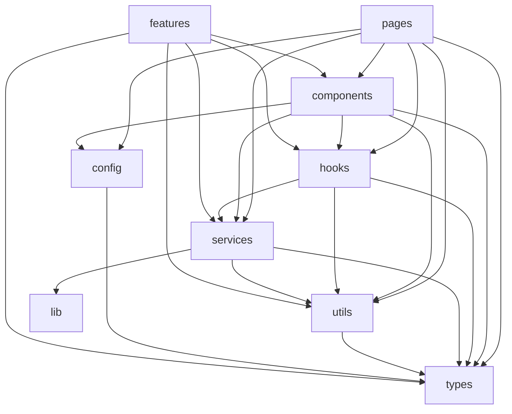

# Folder and file structure plan

This document is the **canonical plan** for how code should be organized under `src/`. It defines **responsibilities by folder** so the repo stays scalable and easy to navigate. For a shorter snapshot of the current layout, see [ARCHITECTURE.md](./ARCHITECTURE.md).

---

## Principles

1. **`pages/` is modular** — Under `pages/`, each **first-level folder is a module** (domain): e.g. `projects/`, `settings/`, `auth/`. That folder contains **all route-level screens** for that domain—one file (or a small set) per URL segment, not mixed business logic.
2. **Pages stay thin** — Page files only **map routes to UI** and **compose layout**: read params, choose sections, pass props. They do **not** own business rules, data transforms, API shapes, or reusable widgets.
3. **Layers over nesting elsewhere** — Outside `pages/`, group by **role** first (`components`, `hooks`, `services`, …), then by **domain** inside that layer (`project`, `tasks`, …) when the area is large enough to deserve a subfolder.
4. **Separation of concerns** — **Business logic** and **data handling** live in `hooks/` and `services/` (and `utils/` for pure functions). **Reusable UI** lives in `components/` (`ui/` for primitives, `<domain>/` for feature widgets). **Types** live in `types/`.
5. **One direction of dependencies** — Higher-level modules may depend on lower-level ones, not the reverse (e.g. `services` must not import from `pages`).
6. **Stable imports** — Prefer the `@/` path alias and barrels (`index.ts`) where they improve clarity without hiding too much.

---

## Dependency direction (allowed arrows)



**Do not:** import `pages` from `components`, `hooks`, `services`, or `utils`. **Avoid:** `features` importing from `pages` (features should remain library-like).

---

## `pages/` — one module per folder, route screens only

**Module model:** `pages/<module>/` groups **every route-level page** for that product area. Examples: `pages/projects/` (catalog + project-scoped routes), `pages/settings/` (org settings tabs), `pages/auth/` (login, signup, recovery). Cross-cutting wrappers that are not a product module live under `pages/shared/`.

| Responsibility | Yes | No |
|----------------|-----|-----|
| Map URL to a screen | ✓ | |
| Read route params / search params | ✓ | |
| Compose layout + feature sections (import from `components/`) | ✓ | |
| Call hooks that encapsulate data loading / mutations | ✓ (orchestration only; logic stays in the hook) | |
| **Implement** business rules, validation rules, or domain calculations | | ✗ → `hooks/`, `utils/`, or `services/` |
| **Perform** HTTP calls, persistence, or fixture loading inline | | ✗ → `services/` (and thin `hooks/` if needed) |
| **Define** reusable cards, tables, modals, drawers | | ✗ → `components/` (`ui/` or `components/<domain>/`) |
| Large mock datasets or fixtures | | ✗ → `services/<domain>/` (or dedicated mock modules) |

**File naming:** Under `pages/<module>/`, omit redundant prefixes when the module name already scopes the file (e.g. `pages/projects/TasksPage.tsx`, not `ProjectTasksPage.tsx`).

**Current modules:** `auth/`, `onboarding/`, `home/`, `dashboard/`, `workspace/`, `settings/`, `projects/`, `dev/`, `shared/`.

---

## `components/` — UI building blocks and app shell

| Subfolder | Responsibility |
|-----------|----------------|
| `ui/` | Design-system-style **primitives** (Button, Input, DataTable, Dialog). No route awareness, no `useParams`. |
| `layout/` | **App shell**: dashboard frame, sidebar, header, global search. |
| `theme/` | Theme context and toggles (`ThemeProvider`, `useTheme`). |
| `providers/` | Cross-cutting React providers (e.g. Redux `StoreProvider`). |
| `auth/` | **Auth UI** and auth-related providers used by routes (distinct from `pages/auth/` which are *screens*). |
| `brand/` | Logos and marks. |
| `<domain>/` | Feature-specific UI reused across pages (e.g. `project/` for project modals, module shell, drawers). |

**Rule:** If a JSX tree is reused on more than one route or is clearly a **widget**, it belongs in `components/`, not in `pages/`.

---

## `hooks/` — React hooks

| Responsibility | Details |
|----------------|---------|
| Stateful or browser-bound logic | `useLocalStorage`, `useDebouncedValue`, `useMediaQuery`. |
| Domain hooks | e.g. `hooks/project/useProjectUi.ts` — context consumers tied to project UI. |
| Data-fetch orchestration | Hooks that call `services/` and expose `{ data, error, isLoading }` are appropriate here. |

**Naming:** `useSomething.ts` (or `useSomething.tsx` if the file must contain JSX for a tiny helper—prefer keeping JSX in components).

**Rule:** Hooks should not import from `pages/`.

---

## `services/` — side effects, APIs, persistence

| Responsibility | Examples |
|----------------|----------|
| HTTP / REST / GraphQL | `services/project/projectApi.ts` |
| Non-HTTP I/O | `services/project/lastRoute.ts` (localStorage) |
| Demo / mock data used like a backend | `services/project/projectDummyData.ts`, fixtures |

**Rule:** No React components here (except rare data-only patterns—prefer keeping UI out).

---

## `utils/` — pure functions

| Responsibility | Examples |
|----------------|----------|
| Formatting, parsing, sorting | `utils/project/display.ts` |
| Derived stats from in-memory fixtures | `utils/project/overviewTaskStats.ts` |
| Breadcrumb builders | `utils/project/breadcrumbs.ts` |

**Rule:** No React imports if avoidable; no network I/O (use `services/`).

---

## `types/` — TypeScript types

| Responsibility | Examples |
|----------------|----------|
| Shapes shared across layers | `types/task.ts`, `types/project.ts` |
| Domain-specific types | `types/project/mockUi.ts` |

**Rule:** Prefer types over `any`; co-locate small types next to a module only when they are not shared.

---

## `config/` — static configuration

Navigation definitions, PM label maps, feature flags as data. **No** heavy runtime logic.

---

## `lib/` — app infrastructure

API client setup, token storage, RBAC helpers, i18n bootstrap helpers—**cross-cutting** utilities that are not domain-specific.

---

## `store/` — global client state

Redux (or similar): slices, store factory, typed hooks.

---

## Task & drawing code (no `features/` folder)

Task UI, fixtures, and filters live under **`components/task/`** and **`utils/task/`**; task list state and mutations are coordinated in **`hooks/task/TaskProjectContext.tsx`** (calls **`services/task/taskService.ts`**). Plan / PDF viewer widgets live under **`components/project/drawing/`** with helpers in **`utils/project/planPdf.ts`** and **`utils/project/taskDrag.ts`**. In-app task notification stubs live in **`utils/notification/taskNotifications.ts`**.

---

## `routes/`, `api/`, `i18n/`, `locales/`, `styles/`

| Path | Responsibility |
|------|----------------|
| `routes/` | Route guards (`ProtectedRoute`), optional route tables. |
| `api/` | Optional **re-exports** for backward compatibility; prefer new code in `services/`. |
| `i18n/`, `locales/` | Internationalization setup and JSON catalogs. |
| `styles/` | Global CSS, tokens, fonts. |

---

## Checklist for new code

- [ ] New screen → add under the correct **`pages/<module>/`**, keep the file thin (routing + composition only).
- [ ] Reused UI → `components/` (`ui/` vs domain folder).
- [ ] Reused stateful logic → `hooks/`.
- [ ] Network or storage → `services/`.
- [ ] Pure transforms → `utils/`.
- [ ] Shared shapes → `types/`.
- [ ] Import path uses `@/` and does not create cycles.

---

## Appendix: current `src/` tree (verify against your checkout)

Omitted: `node_modules/`, build output. Paths use `/` for readability; on disk they are under `src/`.

```
src/
├── App.tsx
├── main.tsx
├── vite-env.d.ts
│
├── api/                          # legacy / thin re-exports
│   ├── auth.ts
│   ├── organizations.ts
│   ├── projects.ts
│   └── tasks.ts
│
├── components/
│   ├── auth/                     # auth UI + AuthProvider (not route modules)
│   │   ├── AuthProvider.tsx
│   │   ├── EmailVerificationBanner.tsx
│   │   ├── LoginForm.tsx
│   │   ├── ResetPasswordForm.tsx
│   │   ├── VerifyEmailForm.tsx
│   │   └── WelcomeContent.tsx
│   ├── brand/
│   │   ├── BuildWireLogo.tsx
│   │   └── BuildWireMark.tsx
│   ├── layout/                   # app shell (+ index.ts barrel)
│   │   ├── AccountDropdown.tsx
│   │   ├── DashboardLayout.tsx
│   │   ├── GlobalSearchBar.tsx
│   │   ├── GlobalSearchContext.tsx
│   │   ├── header.tsx
│   │   ├── index.ts
│   │   ├── LanguageMenu.tsx
│   │   ├── sidebar.tsx
│   │   └── SidebarLayoutContext.tsx
│   ├── project/                  # project workspace UI (+ index.ts)
│   │   ├── drawers/
│   │   │   ├── DailyReportDrawer.tsx
│   │   │   └── InspectionDrawers.tsx
│   │   ├── overview/
│   │   │   ├── OverviewExecutionSnapshot.tsx
│   │   │   └── OverviewRollups.tsx
│   │   ├── drawing/              # plan / PDF viewer
│   │   │   ├── DrawingViewerTaskPanel.tsx
│   │   │   ├── DrawingViewerToolbar.tsx
│   │   │   ├── index.ts
│   │   │   ├── PdfPlanViewer.tsx
│   │   │   └── PlanCanvasViewer.tsx
│   │   ├── CreateProjectModal.tsx
│   │   ├── DeleteProjectDialog.tsx
│   │   ├── EditProjectModal.tsx
│   │   ├── FilterChipGroup.tsx
│   │   ├── FilterPopover.tsx
│   │   ├── index.ts
│   │   ├── ModulePageShell.tsx
│   │   ├── ModuleSplitLayout.tsx
│   │   ├── ProjectCard.tsx
│   │   ├── ProjectIndexEntry.tsx
│   │   ├── ProjectMembersSection.tsx
│   │   ├── ProjectRouteLayout.tsx
│   │   ├── ProjectsListEmpty.tsx
│   │   ├── ProjectStatusBadge.tsx
│   │   ├── ProjectTaskStats.tsx
│   │   ├── ProjectUiContext.ts
│   │   ├── ProjectUiProvider.tsx
│   │   └── SemanticPill.tsx
│   ├── task/                     # task workspace UI (see repo for full file list)
│   ├── providers/
│   │   ├── index.ts
│   │   └── StoreProvider.tsx
│   ├── theme/
│   │   ├── index.ts
│   │   ├── ThemeProvider.tsx
│   │   └── ThemeToggle.tsx
│   └── ui/                         # primitives (+ index.ts, README.md)
│       ├── alert.tsx
│       ├── avatar.tsx
│       ├── badge.tsx
│       ├── button.tsx
│       ├── checkbox.tsx
│       ├── confirm-dialog.tsx
│       ├── data-table.tsx
│       ├── date-picker.tsx
│       ├── empty-state.tsx
│       ├── file-upload.tsx
│       ├── index.ts
│       ├── input.tsx
│       ├── kpi-stat-card.tsx
│       ├── page-header.tsx
│       ├── progress-bar.tsx
│       ├── radio-group.tsx
│       ├── README.md
│       ├── segmented-control.tsx
│       ├── select.tsx
│       ├── sheet-drawer.tsx
│       ├── skeleton.tsx
│       ├── spinner.tsx
│       ├── stats-bar.tsx
│       ├── textarea.tsx
│       └── tooltip.tsx
│
├── config/
│   ├── navigation/
│   │   ├── global-sidebar.tsx
│   │   ├── icons.tsx
│   │   ├── nav-types.ts
│   │   └── project-sidebar.tsx
│   └── pm/
│       ├── activity.ts
│       ├── daily-reports.ts
│       ├── drawings.ts
│       ├── files.ts
│       ├── inspections.ts
│       ├── inventory.ts
│       ├── meetings.ts
│       ├── reports.ts
│       ├── rfi.ts
│       └── team.ts
│
├── design-system/
│   ├── index.ts
│   └── pm-label-system.ts
│
├── hooks/
│   ├── project/
│   │   └── useProjectUi.ts
│   ├── task/
│   │   └── TaskProjectContext.tsx
│   ├── useDebouncedValue.ts
│   └── useSidebarMode.ts
│
├── i18n/
│   ├── AppI18n.tsx
│   ├── i18n.ts
│   ├── locales.ts
│   └── setLocale.ts
│
├── lib/
│   ├── api.ts
│   ├── kanbanBoardPrefs.ts
│   ├── rbac.ts
│   ├── theme.ts
│   ├── theme-utils.ts
│   ├── tokenStore.ts
│   └── userPreferences.ts
│
├── locales/
│   ├── ar/translation.json
│   ├── en/translation.json
│   ├── es/translation.json
│   └── hi/translation.json
│
├── pages/                        # one folder = one module (domain routes)
│   ├── auth/
│   │   ├── index.ts
│   │   ├── ForgotPasswordPage.tsx
│   │   ├── LoginPage.tsx
│   │   ├── ResetPasswordPage.tsx
│   │   ├── SignupPage.tsx
│   │   └── VerifyEmailPage.tsx
│   ├── dashboard/
│   │   ├── index.ts
│   │   └── DashboardPage.tsx
│   ├── dev/
│   │   ├── index.ts
│   │   └── ComponentsShowcasePage.tsx
│   ├── home/
│   │   ├── index.ts
│   │   └── HomePage.tsx
│   ├── onboarding/
│   │   ├── index.ts
│   │   ├── InvitePage.tsx
│   │   └── WelcomePage.tsx
│   ├── projects/
│   │   ├── ActivityPage.tsx
│   │   ├── BudgetPage.tsx
│   │   ├── BudgetRedirect.tsx
│   │   ├── DailyReportsPage.tsx
│   │   ├── DrawingsPage.tsx
│   │   ├── DrawingViewerPage.tsx
│   │   ├── FilesPage.tsx
│   │   ├── FinancialsPage.tsx
│   │   ├── InspectionsPage.tsx
│   │   ├── InventoryPage.tsx
│   │   ├── ListPage.tsx
│   │   ├── MeetingsPage.tsx
│   │   ├── OverviewPage.tsx
│   │   ├── ReportsPage.tsx
│   │   ├── RfisPage.tsx
│   │   ├── SchedulePage.tsx
│   │   ├── TasksPage.tsx
│   │   └── TeamPage.tsx
│   ├── settings/
│   │   ├── index.ts
│   │   ├── BillingPage.tsx
│   │   ├── BotIntegrationsPage.tsx
│   │   ├── OrganizationPage.tsx
│   │   ├── PreferencesPage.tsx
│   │   ├── RolesPage.tsx
│   │   └── TeamPage.tsx
│   ├── shared/
│   │   └── AppPage.tsx
│   └── workspace/
│       ├── index.ts
│       ├── AiMapPage.tsx
│       ├── BrokersPage.tsx
│       └── SalesPage.tsx
│
├── routes/
│   └── ProtectedRoute.tsx
│
├── services/
│   ├── auth/
│   │   └── authService.ts
│   ├── organization/
│   │   └── organizationService.ts
│   ├── project/
│   │   ├── lastRoute.ts
│   │   ├── projectApi.ts
│   │   ├── projectDummyData.ts
│   │   └── projectFixtures.ts
│   └── task/
│       └── taskService.ts
│
├── store/
│   ├── authSlice.ts
│   ├── hooks.ts
│   └── store.ts
│
├── styles/
│   ├── globals.css
│   └── workspace-themes.css
│
├── types/
│   ├── project/
│   │   └── mockUi.ts
│   ├── organization.ts
│   ├── project.ts
│   ├── rbac.ts
│   └── task.ts
│
└── utils/
    ├── notification/
    │   └── taskNotifications.ts
    ├── project/
    │   ├── breadcrumbs.ts
    │   ├── display.ts
    │   ├── overviewTaskStats.ts
    │   ├── planPdf.ts
    │   └── taskDrag.ts
    └── task/
        └── …                     # fixtures, filters, factories, etc. (see repo)
```

**Note:** Under `pages/auth`, `pages/projects`, etc., each folder lists **only route-level page files** in your tree explorer; barrels are `index.ts` where present. Expand those folders locally to compare filenames.

---

## Related

- [ARCHITECTURE.md](./ARCHITECTURE.md) — current `components/` and `pages/` layout as implemented today.
- [README.md](../README.md) — high-level repo tree and scripts.
